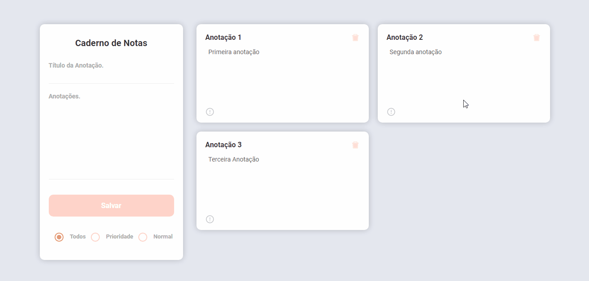

# Countries-app

## Demo 📸

 

## Application deploy with heroku and netlify: :dash:

> day-notes.netlify.app

## 📜 About the Project

Day-notes is a notes book project full-stack to control notes in database. The user can create, read, delete and put your annotations besides define how priority your notes.

### 📋 User Stories:

 - [x] - User can create new annotations.
 - [x] - User can delete annotations.
 - [x] - User can do alterations in annotations exists.
 - [x] - User can filter annotations by normal, priority and all.
 - [x] - User can let a annontation how priority and normal.

### 🛠 Technologies

<li><a href="https://reactjs.org">React.js</a></li>
<li><a href="https://nodejs.org/en/">Node.js</a></li>
<li><a href="https://www.mongodb.com/pt-br">MongoDB</a></li>
<li><a href="https://github.com/axios/axios">Axios</a></li>
<li><a href="https://expressjs.com">Express.js</a></li>
<li><a href="https://mongoosejs.com">Mongoose</a></li>
<li><a href="https://www.npmjs.com/package/nodemon">Nodemon</a></li>
<li><a href="https://material-ui.com/pt/">Material-UI</a></li>
<li><a href="https://react-icons.github.io/react-icons/">React-icons</a></li>
<li><a href="https://editorconfig.org">EditorConfig</a></li>

## 💻 How to run the application

#### Pre-requisites:
You must have the tools installed:  <a href="">Git</a>, <a href="">Node.js</a>.
You must have a acount in <a href="https://www.mongodb.com/pt-br">MongoDB</a> to get a connection string.

Create a file with name: .env, and paste your connection string from MongoDB (Your database) in formate bellow:
REACT_APP_MONGODB_URI=YourStringHere

<pre>
1 - In the terminal, clone the project:
$ git clone https://github.com/Wesley-wsl/day-notes.git

2 - Enter the project folder:
$ cd day-notes

3 - Enter the frontend folder and install the dependencies:
$ cd frontend
$ yarn install
ou
$ npm install

4 - Now start server:
$ yarn start
ou
$ npm run start

# Do the same process from step three entering the backend folder.

</pre>

Okay, now you can access the application from the route:  <a href="https://localhost:3000/">https://localhost:3000/</a>
